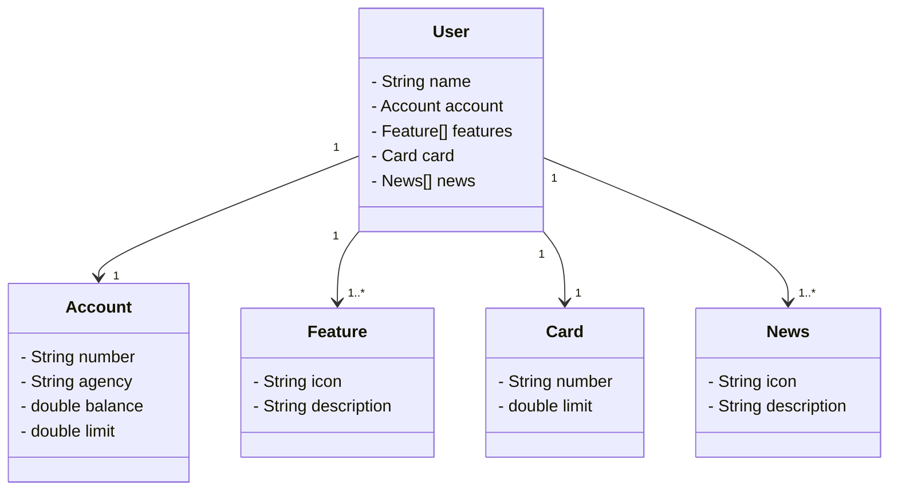

# UrbanBank

*Conectando a modernidade das cidades com o mundo financeiro.*

## Diagrama de classes do APP

- Acessar o H2 via browser: http://localhost:8080/h2-console/
- Testar API via Swagger: http://localhost:8080/swagger-ui/index.html