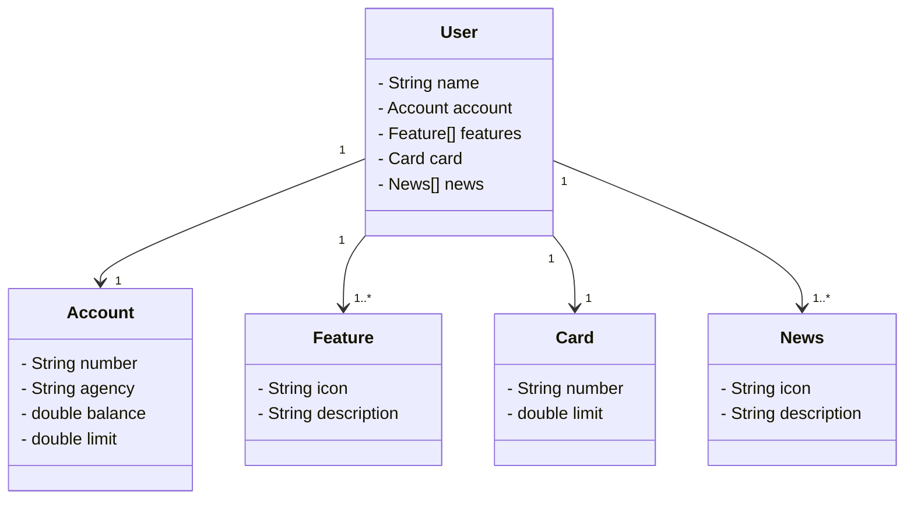

# UrbanBank

*Conectando a modernidade das cidades com o mundo financeiro.*

UrbanBank é uma RESTful API desenvolvida como trabalho de conclusão de curso para Java Spring Boot Claro,
realizada pela Digital Innovation One.

## Diagrama de classes do APP



## Rodando o APP

Clone o projeto

```bash
  git clone https://github.com/allecosta/UrbanBank.git
```

Entre no diretório do projeto

```bash
  cd UrbanBank
```
Inicie o servidor

```bash
  Run Application Dev (ou shift+F10 no intellij)
```
- Após upar o servidor acesse: http://localhost:8080/swagger-ui/index.html


- Para acessar o H2 e realizar testes: http://localhost:8080/h2-console/


## Tecnologias

- **Java 21:** Utilizei a versão mais recente do Java para tirar vantagem das últimas inovações;
- **Spring Boot 3:** Para maximiza a produtividade por meio de sua poderosa premissa de autoconfiguração;
- **Spring Data JPA (com o H2 para dados em memória):** Com essa ferramenta simplificamos nossa camada de acesso aos dados, facilitando a integração com bancos de dados SQL;
- **OpenAPI (Swagger):** Documentação e testes da API de forma eficaz e fácil de entender, perfeitamente alinhada com a alta produtividade que o Spring Boot oferece;
- **PostgresSQL:** Para testes de persitência de dados em produção;
- **Gradle:** Como ferramenta de build.